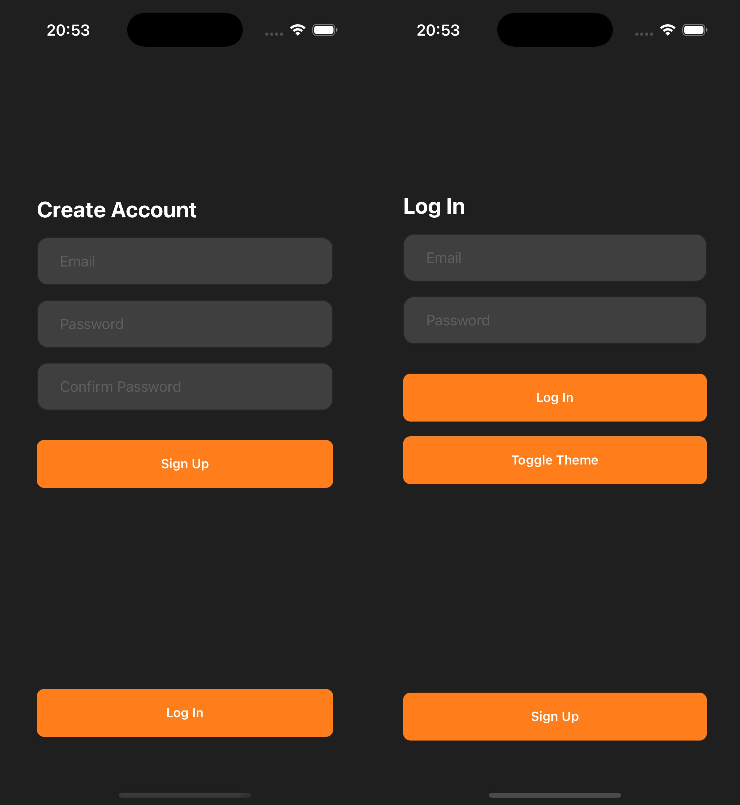
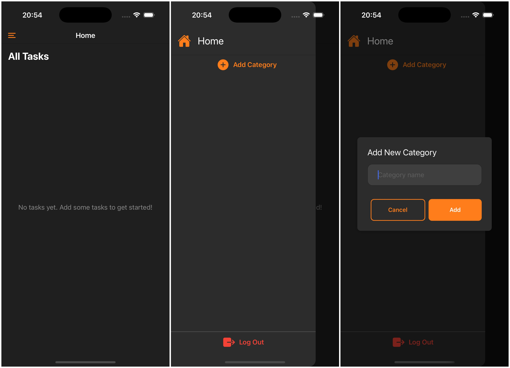
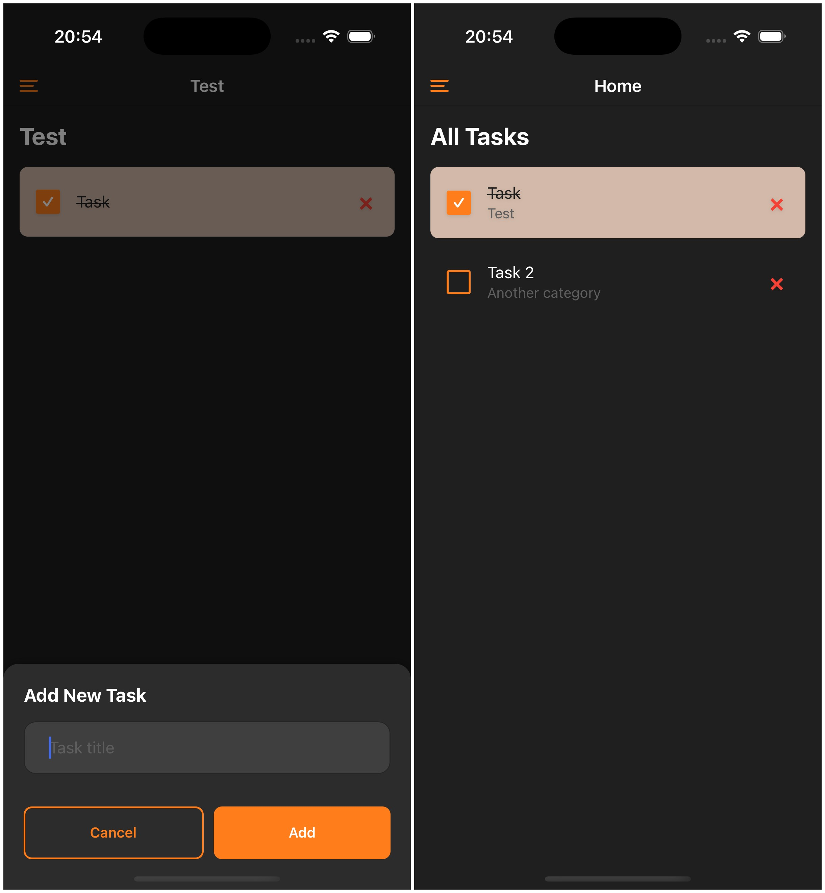

### Впроваджено:
1) Аутентифікація користувачів
   - Додано реєстрацію та логін через Supabase Auth.
   - Реалізовано перевірку email + пароль, з обробкою помилок.
2) Збереження та отримання даних
   - Усі завдання та категорії тепер зберігаються у базі даних Supabase.
   - При вході користувача застосунок автоматично підтягує відповідні дані з бази.
   - Додавання, оновлення, видалення завдань синхронізуються з Supabase в режимі реального часу.
3) Прив’язка даних до користувача
   - Кожен запис (завдання або категорія) містить user_id, що дозволяє відображати тільки персональні дані користувача.
### Логіка прийнятих рішень
#### Чому Supabase?
- Простота інтеграції з React Native (через REST або client SDK).
- Хостинг, БД, аутентифікація в одному рішенні.
- Безпечне зберігання даних без складної конфігурації бекенду.
#### Основні міркування:
- Масштабованість — зберігання в Supabase дозволяє працювати з даними з будь-якого пристрою.
Безпека — кожен користувач має доступ лише до своїх завдань.
- Синхронізація — оновлення даних у реальному часі при кожній дії (створення, завершення, видалення).
- Простота локальної логіки — React-сторона відповідає лише за відображення й виклики до Supabase.
#### Переваги для користувача:
- Не потрібно зберігати дані локально чи втрачати їх після виходу.
- Можливість увійти з будь-якого пристрою та отримати свої завдання.
- Проста реєстрація та безпечне зберігання персональних списків справ.

### Екрани застосунку
#### Екрани авторизації та реєстрації:

#### Домашній екран без завдань, бокове меню, та модальне вікно додавання категорії:

#### Бокове меню з категоріями, екран категорії з завданнями:

#### Екран додавання завдання:

