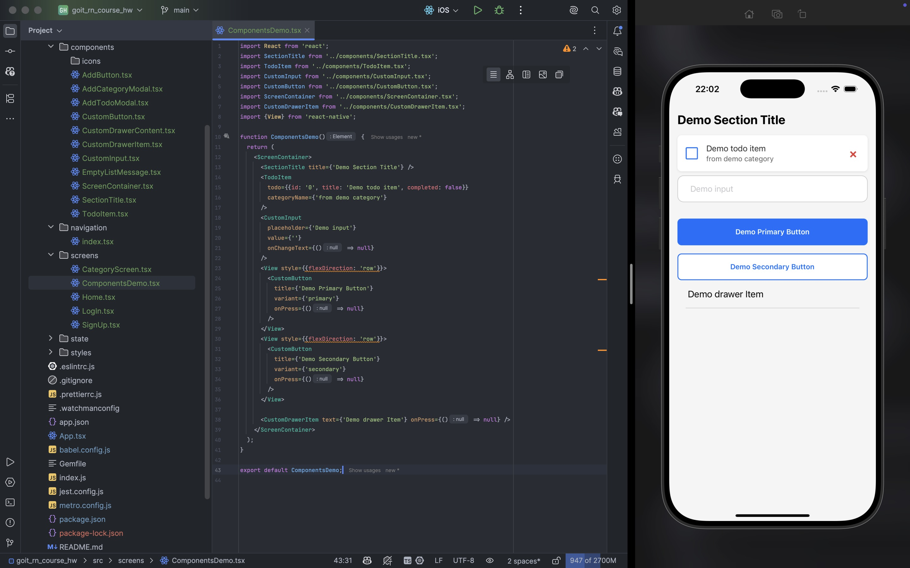
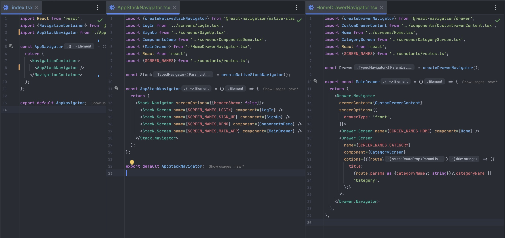
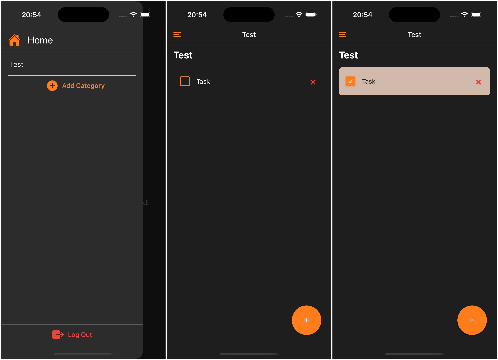

## HW-3

Custom components for reusability:
 - ScreenContainer
 - SectionTitle
 - TodoItem
 - CustomInput
 - CustomButton
 - CustomDrawerItem

## HW-4
Screens: Login, SignUp, Demo, MainApp, Home, Category.
Navigators: 
 - MainStack (Login, SignUp, Demo, MainApp)
 - DrawerNavigator (Home, Category)

## HW-5
Categories and Todos are loaded from JSON api server (db.json).

## HW-6
Theme changes using Context API. All data in app is loaded from API and AsyncStorage using Redux.
The example is in demo4.mp4 file.