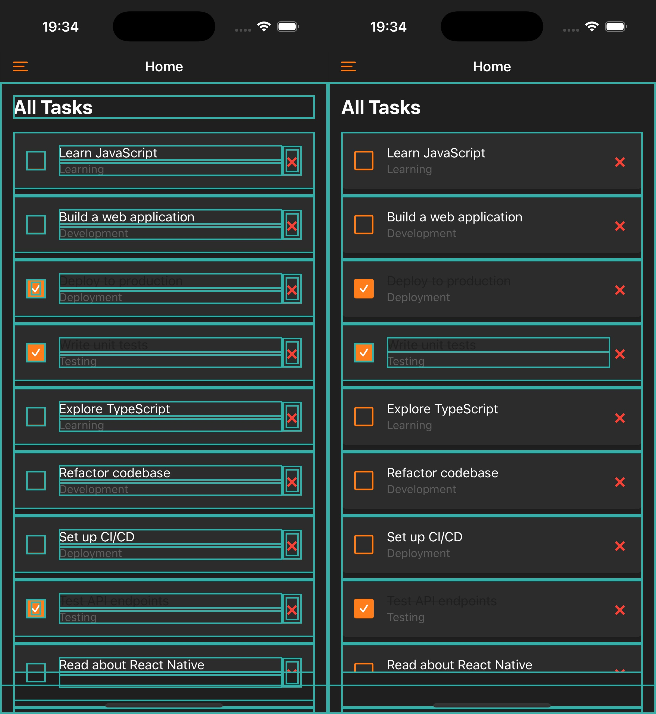
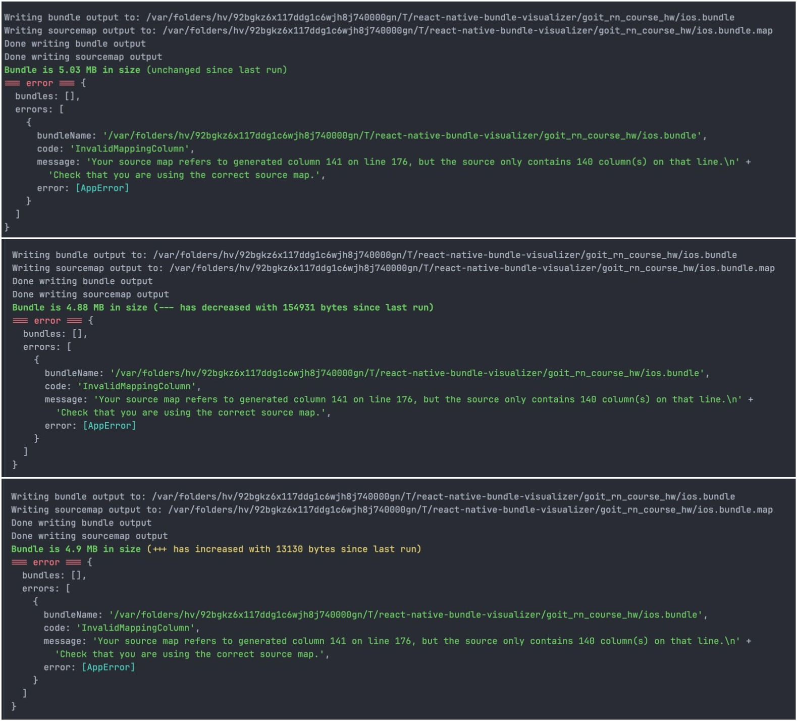

## HW-3

Custom components for reusability:
 - ScreenContainer
 - SectionTitle
 - TodoItem
 - CustomInput
 - CustomButton
 - CustomDrawerItem

## HW-4
Screens: Login, SignUp, Demo, MainApp, Home, Category.
Navigators: 
 - MainStack (Login, SignUp, Demo, MainApp)
 - DrawerNavigator (Home, Category)

## HW-5
Categories and Todos are loaded from JSON api server (db.json).

## HW-6
Theme changes using Context API. All data in app is loaded from API and AsyncStorage using Redux.
The example is in demo4.mp4 file.

## HW-7
Todo completion animation was implemented using React Native Reanimated.
example can be found in demo7_1.mp4 file in the repo

The todo item component and the list are optimized using React.memo and useCallback.

Heavy momentjs library was replaced with dayjs, this resulted in 0.13 MB size reduction for bundle. Screenshots:
1) Before momentjs removal
2) After momentjs removal
3) After dayjs addition
